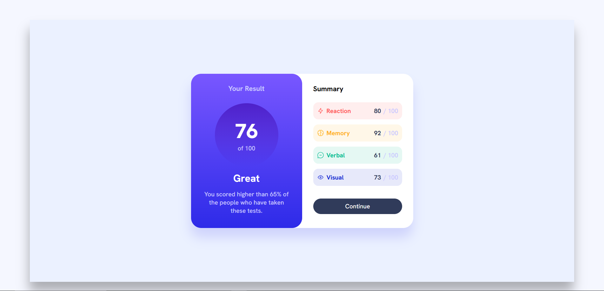

# Frontend-Mentor
Mainly challenges I’m working on or have completed.
# Results Summary Component

This is a solution to the Frontend Mentor challenge.

## Screenshot

## Links

- Live Site URL: https://zoltanszabo91.github.io/Frontend-Mentor/
- Repository URL: https://github.com/ZoltanSzabo91/Frontend-Mentor

## Built with

- HTML5
- CSS (Flexbox)

## What I learned

I practiced using Flexbox for layout and learned how to create responsive designs with media queries. I also improved my understanding of CSS properties like aspect-ratio and box-shadow.

## Author

- GitHub - https://github.com/ZoltanSzabo91
